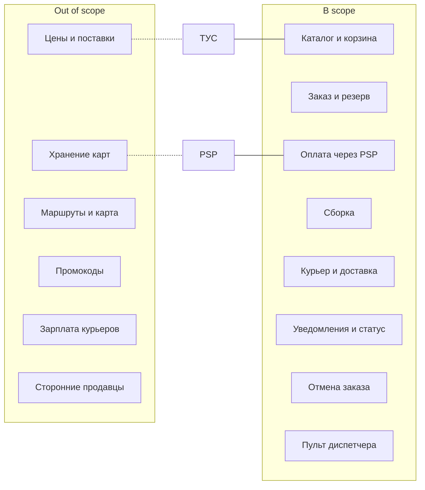
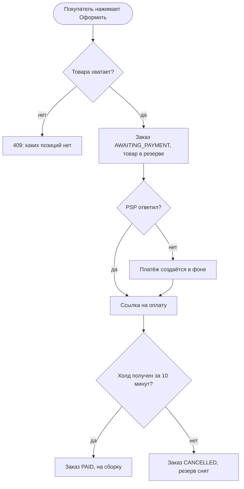
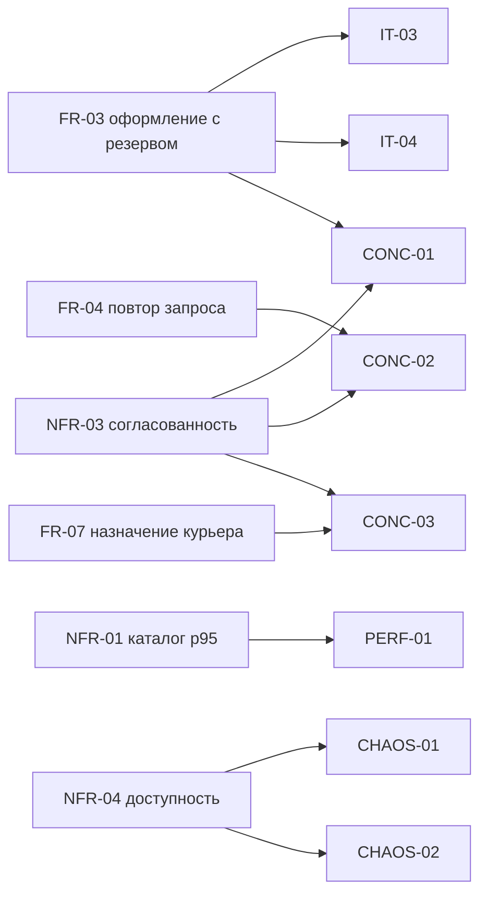

# SRS-lite: eat-easy

Версия: v1, 29.09.2026

## 1. Overview

eat-easy — сервис доставки продуктов из собственных дарксторов за 30 минут. Покупатель выбирает товары в приложении, оплачивает заказ, сборщик собирает его в дарксторе, курьер привозит.

Система отвечает за три вещи, ошибки в которых обходятся дороже всего: остаток товара, оплата заказа и назначение курьера. Термины — в [глоссарии](../glossary.md), общая картина — в [Vision & Scope](../hw1/vision-scope.md).

Нагрузка, от которой я считал все числа в NFR:

| Что | Сколько | Откуда |
|---|---|---|
| Дарксторов | 30 | цель первого года |
| Заказов в сутки | 60 000 | 2 000 на даркстор |
| Заказов в пиковый час | 9 000, это 2,5 в секунду | 15% суточного объёма приходится на один вечерний час, на всё окно 18–21 — около 40% |
| Всплеск оформлений | до 10 в секунду | пик × 4: дождь, рассылка push |
| Запросов к каталогу в пике | 1 000 в секунду | 2,5 заказа/с × 5 сессий на заказ × 40 запросов за сессию = 500, запас ×2 |
| Товаров в дарксторе | 3 000 | обычный ассортимент |

## 2. Scope / Out-of-scope

**В scope:**

- каталог по адресу покупателя с остатками;
- корзина, оформление заказа, резерв товара;
- онлайн-оплата через платёжного провайдера (PSP);
- сборка заказа в дарксторе;
- назначение курьера и статусы доставки;
- уведомления и отслеживание статуса заказа;
- отмена заказа;
- пульт диспетчера для проблемных заказов.

**Out of scope:**

- обработка платежей и хранение карт — делает PSP, у нас только идентификатор платежа;
- ассортимент, цены, поставки — приходят из товароучётной системы (ТУС);
- построение маршрутов и отслеживание курьера на карте;
- зарплата курьеров;
- промокоды и лояльность;
- товары сторонних продавцов.

## 3. Stakeholders

| Кто | Цель | Проблема | Метрика успеха |
|---|---|---|---|
| Покупатель | Получить весь заказ за 30 минут | Оплатил товар, которого нет. Списали дважды | 90% заказов за 30 минут, 0 двойных списаний |
| Сборщик | Собрать заказ без лишних перемещений по складу | В задании товар, которого нет на полке | Меньше 2% позиций «нет на полке» |
| Курьер | Получать заказы своего даркстора без простоев | Приехал, а заказ отдали другому | 0 двойных назначений |
| Диспетчер | Быстро разобраться с проблемным заказом | Не видно, что с заказом и кто что менял | Проблемный заказ виден на пульте за 3 минуты |
| Операционный директор | Держать «30 минут» в вечерний пик | Сервис недоступен вечером, заказы потеряны | Доступность 99,9% |
| Эксплуатация | Узнавать о сбоях раньше покупателей | О сбое сообщает поддержка, а не мониторинг | Сбой замечен за 5 минут |

## 4. Use cases

### UC-1. Оформление и оплата заказа

Актор: покупатель. До начала: покупатель вошёл в приложение, адрес попадает в зону даркстора.

Основной поток:

1. Покупатель открывает каталог, видит товары и остатки своего даркстора.
2. Складывает товары в корзину, видит сумму.
3. Нажимает «Оформить». Система резервирует товар и создаёт заказ в статусе `AWAITING_PAYMENT`.
4. Система создаёт платёж у PSP и отдаёт покупателю ссылку на оплату.
5. Покупатель подтверждает оплату. PSP присылает вебхук, что деньги захолдированы.
6. Заказ переходит в `PAID` и уходит на сборку.

Альтернативные потоки:

- A1. Товара не хватает — заказ не создаётся, покупатель видит, каких позиций нет.
- A2. Пропала сеть, приложение повторило запрос — второй заказ не создаётся, возвращается первый.
- A3. PSP не отвечает — заказ создан и ждёт оплату, платёж создаётся в фоне.
- A4. Банк отклонил оплату — заказ остаётся в `AWAITING_PAYMENT`, покупатель может оплатить ещё раз.
- A5. Оплата не пришла за 10 минут — заказ отменяется, резерв снимается.

### UC-2. Сборка и доставка

Акторы: сборщик, курьер. До начала: заказ оплачен (`PAID`).

Основной поток:

1. Сразу после оплаты система предлагает заказ свободному курьеру этого даркстора. У курьера 30 секунд, чтобы принять оффер.
2. Сборщик берёт заказ в работу (`PICKING`) и отмечает собранные позиции. Чего нет на полке — отмечает как отсутствующее.
3. Заказ собран (`READY`). С карты списывается сумма за то, что действительно собрали.
4. Назначенный курьер забирает заказ (`IN_DELIVERY`).
5. Курьер отмечает доставку (`DELIVERED`).

Альтернативные потоки:

- A1. Не собрано ничего — заказ отменяется, холд снимается.
- A2. Курьер не принял оффер за 30 секунд — оффер уходит следующему свободному курьеру.
- A3. Курьер не нашёлся за 3 минуты — заказ появляется на пульте диспетчера, диспетчер назначает курьера вручную или отменяет заказ.

### UC-3. Отмена заказа покупателем

1. Покупатель нажимает «Отменить» в заказе.
2. Если заказ ещё не собран (`AWAITING_PAYMENT`, `PAID`, `PICKING`) — заказ отменяется, резерв снимается, холд отменяется.
3. Если заказ уже собран или в доставке — отменить из приложения нельзя, отмена возможна только через диспетчера.

## 5. FR + Acceptance Criteria

Приоритеты по MoSCoW.

| ID | Требование | Приоритет | UC |
|---|---|---|---|
| FR-01 | Каталог даркстора по адресу с доступным остатком | Must | UC-1 |
| FR-02 | Корзина и расчёт суммы | Must | UC-1 |
| FR-03 | Оформление заказа с резервом товара | Must | UC-1 |
| FR-04 | Повтор запроса не создаёт второй заказ (Idempotency-Key) | Must | UC-1 |
| FR-05 | Онлайн-оплата: холд и списание через PSP | Must | UC-1, UC-2 |
| FR-06 | Сборка заказа | Must | UC-2 |
| FR-07 | Назначение курьера | Must | UC-2 |
| FR-08 | Статусы доставки: забрал, доставил | Must | UC-2 |
| FR-09 | Отмена заказа покупателем | Must | UC-3 |
| FR-10 | Пульт диспетчера: проблемные заказы, ручное назначение, отмена | Must | UC-2, UC-3 |
| FR-11 | Уведомления при смене статуса | Should | UC-1, UC-2 |
| FR-12 | Отслеживание статуса заказа | Should | UC-2 |
| FR-13 | История заказов покупателя | Could | — |

Пульт диспетчера — Must, потому что на него опираются альтернативные потоки обязательных требований: «курьер не найден» в FR-07 и отмена собранного заказа в UC-3.

Критерии приёмки в формате Given / When / Then. У каждого Must есть хотя бы один негативный сценарий.

**FR-01. Каталог**

- Given адрес в зоне даркстора. When `GET /catalog`. Then `200`, у каждого товара цена и доступный остаток.
- Given адрес вне зон доставки. When `GET /catalog`. Then `422 ADDRESS_OUT_OF_ZONE`.

**FR-02. Корзина**

- Given в корзине 2 товара. When `POST /cart/quote`. Then в ответе сумма товаров, стоимость доставки и итог.
- Given количество в корзине больше доступного остатка. When `POST /cart/quote`. Then `409 OUT_OF_STOCK`, в ответе сколько штук доступно.

**FR-03. Оформление с резервом**

- Given все позиции есть в наличии. When `POST /orders`. Then `201`, заказ в `AWAITING_PAYMENT`, резерв по каждой позиции вырос ровно на количество в заказе.
- Given в заказе 3 позиции, одной не хватает. When `POST /orders`. Then `409 OUT_OF_STOCK`, заказ не создан, резерв не изменился ни по одной позиции.
- Given остаток товара равен 1. When два покупателя одновременно оформляют заказ с этим товаром. Then один получает `201`, второй `409`.
- Given запрос без токена. When `POST /orders`. Then `401`.

**FR-04. Повтор запроса**

- Given заказ создан с ключом K. When тот же запрос приходит с ключом K ещё раз. Then `201` и тот же `orderId`, второго заказа и второго платежа нет.
- Given ключ K уже использован. When приходит запрос с ключом K, но другой корзиной. Then `422 IDEMPOTENCY_KEY_REUSED`.

**FR-05. Оплата**

- Given заказ в `AWAITING_PAYMENT`. When PSP присылает вебхук о холде. Then заказ переходит в `PAID`.
- Given вебхук уже обработан. When он приходит второй раз. Then `200`, ничего не меняется.
- Given заказ в `AWAITING_PAYMENT`. When PSP присылает вебхук об отказе банка. Then платёж `FAILED`, заказ остаётся в `AWAITING_PAYMENT`, покупатель может оплатить повторно.
- Given заказ в `AWAITING_PAYMENT`. When холд не получен за 10 минут. Then заказ `CANCELLED`, резерв снят.
- Given вебхук с неверной подписью. When он приходит. Then `401`, статус заказа не меняется.

**FR-06. Сборка**

- Given заказ `PAID`. When сборщик берёт его в работу и отмечает все позиции. Then заказ `READY`, с карты списана сумма собранного.
- Given одной позиции нет на полке. When сборщик завершает сборку. Then списывается сумма без этой позиции, покупатель получает уведомление.
- Given заказ `AWAITING_PAYMENT`. When сборщик пытается взять его в работу. Then `409`: без оплаты заказ не собирается.

**FR-07. Назначение курьера**

- Given на смене есть свободный курьер. When заказ переходит в `PAID`. Then курьер получает оффер не позже чем через 10 секунд.
- Given курьер получил оффер. When он не отвечает 30 секунд. Then оффер уходит следующему свободному курьеру.
- Given курьер уже принял заказ. When другой курьер пытается принять тот же заказ. Then `409 ALREADY_ASSIGNED`.
- Given заказ оплачен, оффер никто не принял. When проходит 3 минуты. Then заказ появляется на пульте диспетчера.

**FR-08. Статусы доставки**

- Given заказ `READY` и курьер назначен. When курьер отмечает «забрал», потом «доставил». Then `IN_DELIVERY`, затем `DELIVERED`.
- Given заказ `PAID`. When курьер отмечает «забрал». Then `409`: заказ ещё не собран.

**FR-09. Отмена покупателем**

- Given заказ `PAID`. When покупатель отменяет. Then заказ `CANCELLED`, резерв снят, холд отменён.
- Given заказ `IN_DELIVERY`. When покупатель отменяет. Then `409 ORDER_NOT_CANCELLABLE`.

**FR-10. Пульт диспетчера**

- Given заказ без курьера дольше 3 минут. When диспетчер открывает пульт. Then заказ есть в списке проблемных.
- Given заказ на пульте. When диспетчер назначает курьера вручную. Then у заказа одно активное назначение, действие записано в журнал аудита.
- Given заказ на пульте. When диспетчер отменяет его. Then заказ `CANCELLED`, в журнале аудита запись: кто, когда, какой заказ.
- Given пользователь без роли диспетчера. When открывает пульт. Then `403`.

**FR-11. Уведомления**

- Given покупатель оформил заказ. When заказ меняет статус. Then push уходит провайдеру не позже чем через 30 секунд.
- Given уведомление по событию уже отправлено. When то же событие приходит второй раз. Then второе уведомление не отправляется.

**FR-12. Отслеживание**

- Given заказ `IN_DELIVERY`. When покупатель открывает заказ. Then видит текущий статус и время его последней смены.
- Given чужой заказ. When `GET /orders/{id}`. Then `404`.

**FR-13. История заказов**

- Given у покупателя есть заказы. When `GET /orders`. Then список от новых к старым, по 20 на страницу.

## 6. NFR с метриками

| ID | Что | Требование | При каких условиях | Как проверяем |
|---|---|---|---|---|
| NFR-01 | Производительность каталога | `GET /catalog`: p95 ≤ 300 мс, p99 ≤ 700 мс | 1 000 запросов в секунду, 30 дарксторов по 3 000 товаров, замер на API Gateway, 30 минут | Нагрузочный тест PERF-01 |
| NFR-02 | Производительность оформления | `POST /orders`: p95 ≤ 1 с, p99 ≤ 2 с | 10 заказов в секунду, 5 позиций в заказе, PSP отвечает за p95 ≤ 500 мс | Нагрузочный тест PERF-02 |
| NFR-03 | Согласованность | Резерв никогда не больше остатка. 0 дублей заказа и платежа при повторе запроса. У заказа не больше одного курьера | 200 одновременных заказов на товар с остатком 1; 50 одинаковых запросов с одним ключом; курьер и диспетчер назначают одновременно | Конкурентные тесты CONC-01, CONC-02, CONC-03 |
| NFR-04 | Доступность | Не меньше 99,9% запросов `GET /catalog` и `POST /orders` за месяц завершаются без ошибки `5xx` (это до 43 минут полного простоя). RPO = 0 для заказов и платежей. RTO ≤ 15 минут при потере одной зоны доступности. Если PSP недоступен, каталог и корзина работают | Отказ узла БД или целой зоны; PSP недоступен 15 минут | CHAOS-01, CHAOS-02 |
| NFR-05 | Безопасность | Все запросы, кроме каталога, требуют токен; вебхуки PSP проверяются по подписи. Чужой заказ — `404`. 100% действий диспетчера в журнале аудита | Запросы под чужим токеном | SEC-01 |
| NFR-06 | Наблюдаемость | У каждого запроса есть correlation-id. Сбой оформления замечаем ≤ 5 минут | Доля ошибок `POST /orders` выше 5% | OPS-01 |
| NFR-07 | Скорость доставки | 90% заказов доставлены за 30 минут от оплаты до `DELIVERED`. Из них на стороне системы: оффер курьеру ≤ 10 секунд после оплаты, задание сборщику ≤ 5 секунд | Вечерний пик | OPS-02: отчёт по времени между `PAID` и `DELIVERED` за неделю |

Конфликты между требованиями:

- NFR-01 и NFR-03. Чтобы каталог был быстрым, нужен кэш, а кэш отстаёт от действительного остатка. Решение: в каталоге остаток может отставать на несколько секунд, а точная проверка делается при оформлении.
- NFR-04 и NFR-02. RPO = 0 требует синхронной реплики, она добавляет 5–10 мс к каждой записи. В бюджет одной секунды это укладывается.

## 7. Constraints / Assumptions

**Constraints** — заданные условия, которые в проекте не меняются:

| ID | Ограничение |
|---|---|
| CON-1 | Команда 8 человек: 3 backend, 2 mobile, 1 frontend, 1 QA, 1 DevOps |
| CON-2 | Первый даркстор должен заработать через 6 месяцев |
| CON-3 | Backend на Java 21, Spring Boot, PostgreSQL — этим стеком владеет команда |
| CON-4 | Персональные данные хранятся в России (152-ФЗ) |
| CON-5 | Данные карт через систему не проходят и в ней не хранятся |

**Assumptions** — то, что я считаю верным, но не проверял:

| ID | Допущение | Что будет, если это не так |
|---|---|---|
| ASM-1 | PSP поддерживает двухстадийную оплату (холд, потом списание) и вебхуки с подписью | Придётся списывать сразу и делать возвраты за несобранное |
| ASM-2 | PSP отвечает за p95 ≤ 500 мс | NFR-02 не выполнить, создание платежа целиком уйдёт в фон |
| ASM-3 | ТУС отдаёт изменения цен и поставок раз в минуту | Остатки после поставки появятся в каталоге позже |
| ASM-4 | Нагрузка из раздела 1 верна с точностью до двух раз | Пересчитывать NFR-01 и NFR-02 |
| ASM-5 | У курьера смартфон с мобильным интернетом | Курьер не получает офферы, заказы уходят на ручное назначение |

## 8. Traceability

| Требование | Чем проверяем | Тесты |
|---|---|---|
| FR-01 | 200 с остатками, 422 вне зоны | IT-01 |
| FR-02 | Сумма считается, 409 при превышении остатка | IT-02 |
| FR-03 | 201 и резерв; 409 без частичного резерва | IT-03, IT-04, CONC-01, E2E-01 |
| FR-04 | Тот же `orderId` при повторе | IT-05, CONC-02 |
| FR-05 | `PAID` по вебхуку, повторный вебхук без эффекта, 401 при неверной подписи | IT-06, E2E-01 |
| FR-06 | `READY` и списание по факту | IT-07, E2E-01 |
| FR-07 | Оффер за 10 секунд, один курьер на заказ | IT-08, CONC-03 |
| FR-08 | Разрешённые переходы, 409 на остальные | IT-09, E2E-01 |
| FR-09 | Отмена до сборки, 409 в доставке | IT-10 |
| FR-10 | Проблемный заказ на пульте, ручное назначение, запись в аудите | IT-11 |
| FR-11 | Уведомление за 30 секунд, без дублей | IT-12 |
| FR-12 | Статус заказа виден, чужой заказ — 404 | IT-13, SEC-01 |
| FR-13 | Список заказов по страницам | IT-14 |
| NFR-01 | p95 ≤ 300 мс при 1 000 rps | PERF-01 |
| NFR-02 | p95 ≤ 1 с при 10 заказах/с | PERF-02 |
| NFR-03 | 1 успех из 200; 1 заказ на ключ; 1 курьер на заказ | CONC-01, CONC-02, CONC-03 |
| NFR-04 | Переключение БД ≤ 60 с без потерь; каталог работает без PSP | CHAOS-01, CHAOS-02 |
| NFR-05 | 404 на чужой заказ, запись в аудите | SEC-01 |
| NFR-06 | Алерт ≤ 5 минут | OPS-01 |
| NFR-07 | 90% заказов за 30 минут | OPS-02 |

Префиксы: IT — интеграционный, E2E — сквозной, PERF — нагрузочный, CONC — конкурентный, CHAOS — тест с отказом, SEC — безопасность, OPS — проверка в эксплуатации.

## Источники

- Лекция 02 «Требования и границы системы».
- Wiegers K., Beatty J. Software Requirements, 3rd ed. Microsoft Press, 2013.
- ISO/IEC 25010 — список атрибутов качества.

## Изменения

- v1, 29.09.2026 — первая версия
