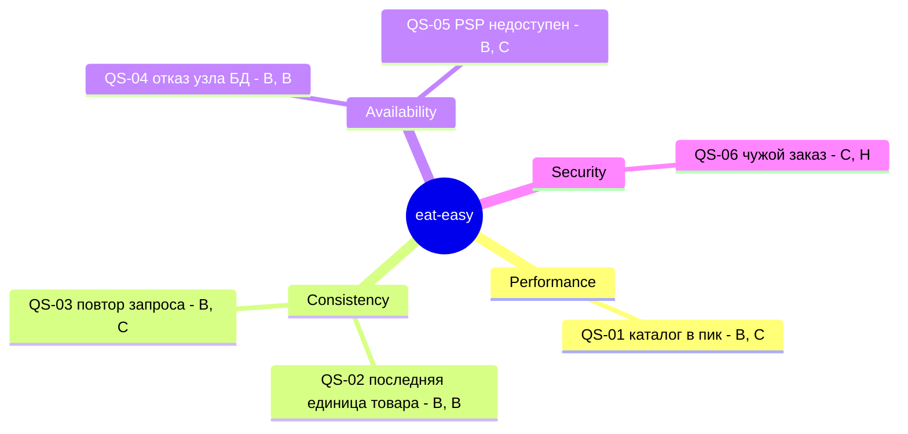

# Драйверы и сценарии качества: eat-easy

Версия: v1, 29.09.2026. Требования — в [SRS](../hw2/srs.md).

## 1. Три архитектурных драйвера

Я выписал всё, что может повлиять на архитектуру: проблемы стейкхолдеров, ограничения, рост нагрузки, внешние зависимости. Потом для каждого пункта ответил на вопрос с лекции: «если это убрать, архитектура станет другой?». Осталось три.

### D-1. Согласованность при одновременных запросах

Что это: резерв не больше остатка, один заказ и один платёж на один запрос, один курьер на заказ (NFR-03).

Почему драйвер: вечером несколько человек одновременно берут один и тот же товар, а приложение повторяет запросы при плохой сети. Ошибка здесь — это «оплатил, а товара нет» или двойное списание.

Что меняет в архитектуре: заказы и остатки должны находиться в одной базе, чтобы резерв и заказ были одной транзакцией. Нужен ключ идемпотентности. Без этого драйвера всё можно было бы разнести по разным сервисам.

Сценарии: QS-02, QS-03.

### D-2. Вечерний пик

Что это: каталог быстрый (NFR-01), оформление работает, даже если отказал узел БД или платёжный провайдер (NFR-04).

Почему драйвер: около 40% заказов приходится на 18–21. Если сервис недоступен вечером, теряется основная часть дневной выручки.

Что меняет: каталог выносится в отдельный сервис с кэшем, база ставится с репликой в другой зоне, вызов PSP ограничивается таймаутом. Без пика хватило бы одного сервиса и одной базы.

Сценарии: QS-01, QS-04, QS-05.

### D-3. Небольшая команда и срок

Что это: 8 человек, из них 3 backend-разработчика и 1 DevOps, первый даркстор через 6 месяцев (CON-1, CON-2).

Почему драйвер: команда должна не только написать систему, но и сама её поддерживать.

Что меняет: чем меньше отдельных сервисов, тем лучше. С командой в 40 человек я бы делил систему иначе.

D-3 — ограничение, а не качество, поэтому сценария качества у него нет. Он учитывается при выборе числа сервисов: варианты архитектуры сравниваются по тому, сколько сервисов придётся поддерживать.

Безопасность и наблюдаемость в драйверы не попали. Они обязательны (NFR-05, NFR-06), но роли, аудит и логи добавляются к любой архитектуре и на её форму не влияют.

## 2. Utility Tree

После названия сценария две буквы: важность для бизнеса и сложность. В — высокая, С — средняя, Н — низкая.

## 3. Сценарии качества

### QS-01. Performance: каталог в вечерний пик

| | |
|---|---|
| Source | Покупатели |
| Stimulus | 1 000 запросов `GET /catalog` в секунду |
| Environment | Вечерний пик, система работает штатно |
| Artifact | Catalog Service |
| Response | Каталог отдаёт товары и остатки |
| Measure | p95 ≤ 300 мс, p99 ≤ 700 мс |

Как проверим: нагрузочный тест PERF-01, 30 минут на 1 000 rps. Данные — время ответа на API Gateway.

### QS-02. Consistency: последняя единица товара

| | |
|---|---|
| Source | 200 покупателей |
| Stimulus | Одновременно оформляют заказ с товаром, которого осталась 1 штука |
| Environment | Вечерний пик |
| Artifact | Order Core, PostgreSQL |
| Response | Создаётся один заказ, остальные получают `409 OUT_OF_STOCK` |
| Measure | Ровно 1 ответ `201`, 199 ответов `409`, резерв равен 1 |

Как проверим: конкурентный тест CONC-01. Данные — коды ответов и строка в таблице остатков.

### QS-03. Consistency: повтор запроса

| | |
|---|---|
| Source | Приложение покупателя |
| Stimulus | Сеть оборвалась, приложение повторило `POST /orders` с тем же Idempotency-Key |
| Environment | Обычная работа |
| Artifact | Order Core |
| Response | Возвращается уже созданный заказ |
| Measure | 1 заказ и 1 платёж на ключ |

Как проверим: тест CONC-02, 50 одинаковых запросов с одним ключом. Данные — число строк в таблицах заказов и платежей.

### QS-04. Availability: отказ узла БД

| | |
|---|---|
| Source | Сбой инфраструктуры |
| Stimulus | Отказывает основной узел PostgreSQL |
| Environment | Вечерний пик |
| Artifact | PostgreSQL, Order Core |
| Response | Синхронная реплика становится основным узлом, запросы повторяются |
| Measure | Запись работает снова не позже чем через 60 секунд, подтверждённые заказы не потеряны |

Как проверим: CHAOS-01 — отключаем основной узел под нагрузкой. Данные — время недоступности на графике ошибок, сверка заказов до и после.

### QS-05. Availability: PSP недоступен

| | |
|---|---|
| Source | Платёжный провайдер |
| Stimulus | Не отвечает 15 минут |
| Environment | Вечерний пик |
| Artifact | Order Core |
| Response | Каталог и корзина работают. Заказ создаётся и ждёт оплату, платёж создаётся в фоне |
| Measure | Каталог в пределах QS-01. `POST /orders` отвечает за p99 ≤ 2 с. 0 заказов ушло на сборку без оплаты |

Как проверим: CHAOS-02 — заглушка PSP перестаёт отвечать. Данные — время ответа, статусы заказов.

Цена решения: неоплаченный заказ живёт 10 минут. Заказы, оформленные в первые 5 минут сбоя, оплатить не успеют и будут отменены.

### QS-06. Security: чужой заказ

| | |
|---|---|
| Source | Авторизованный покупатель или курьер |
| Stimulus | Запрашивает `GET /orders/{id}` чужого заказа |
| Environment | Обычная работа |
| Artifact | Order Core |
| Response | Отказ. Запрос попадает в лог приложения вместе с correlation-id |
| Measure | 100% таких запросов получают `404` |

Как проверим: тест SEC-01 — перебор чужих идентификаторов под своим токеном. Данные — коды ответов и записи в логе.

## 4. Компромиссы между качествами

- Быстрый каталог против точного остатка. Каталог читает остаток из кэша, поэтому иногда покажет товар, который только что закончился. Точная проверка — при оформлении.
- Согласованность против доступности. Если PSP недоступен, можно было бы отправлять заказы на сборку без оплаты. Я этого не делаю: лучше отменить заказ, чем собрать неоплаченный.
- Пик против небольшой команды. Под нагрузку нужно больше отдельных сервисов, а команда для их поддержки мала. Отдельно вынесены только каталог и уведомления.

## Источники

- Лекция 03 «Quality Attributes».
- Bass L., Clements P., Kazman R. Software Architecture in Practice, 4th ed. — шаблон сценария качества и utility tree.

## Изменения

- v1, 29.09.2026 — первая версия
