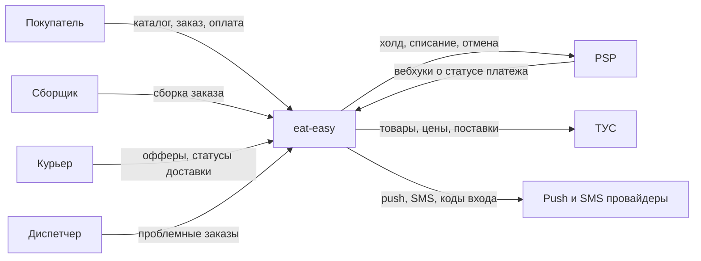
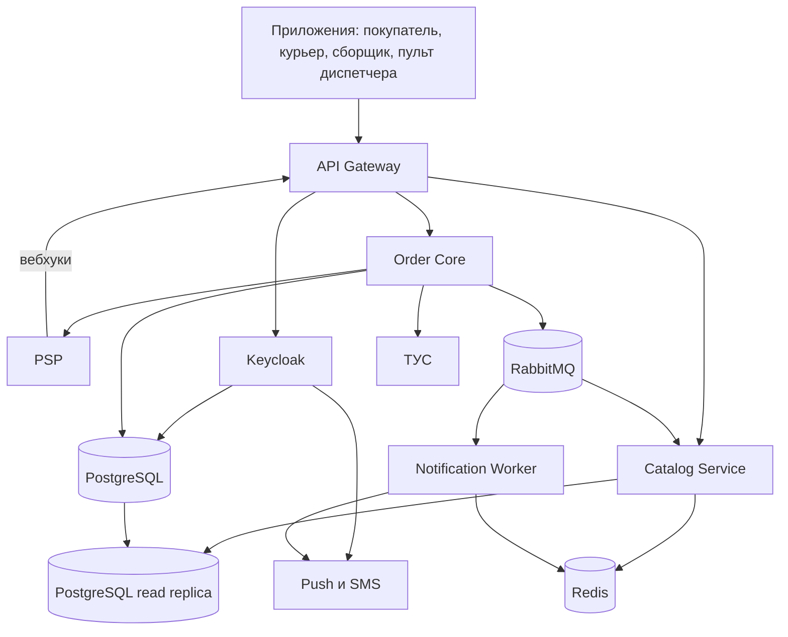
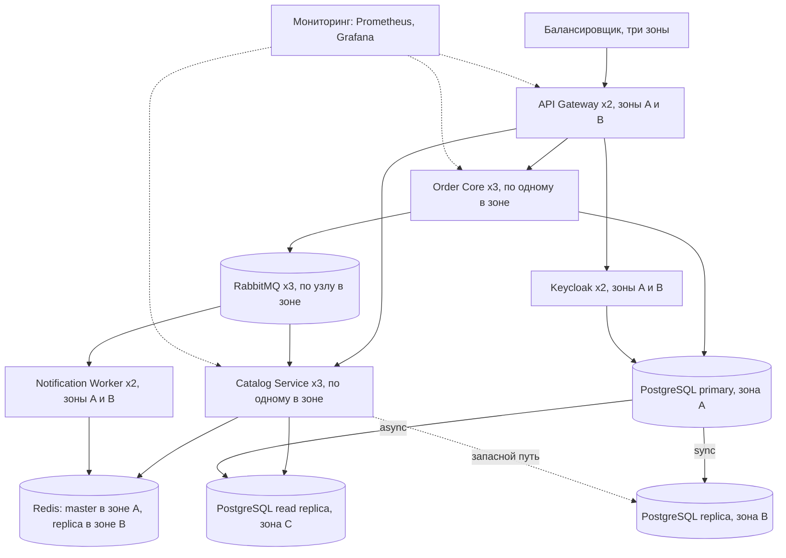

# HLD: eat-easy

Версия: v1, 30.09.2026. Дальше — [MLD](mld.md) и [LLD](lld.md), решения — в [ADR-001](adr-001.md) и [ADR-002](adr-002.md).

## 1. Сценарии качества

Из шести сценариев [ДЗ 3](../hw3/drivers.md) взял три, по одному на каждое качество. Под них строится весь дизайн.

| Сценарий | Что происходит | Мера |
|---|---|---|
| QS-01, Performance | 1 000 запросов к каталогу в секунду | p95 ≤ 300 мс, p99 ≤ 700 мс |
| QS-02, Consistency | 200 покупателей одновременно берут последнюю единицу товара | Ровно 1 заказ создан, 199 получили `409`, резерв не больше остатка |
| QS-05, Availability | PSP не отвечает 15 минут | Каталог работает, `POST /orders` отвечает за p99 ≤ 2 с, без оплаты на сборку не ушёл ни один заказ |

## 2. C4 Context (L1)

| Внешняя система | Зачем нужна | Что будет, если она недоступна |
|---|---|---|
| PSP | Холд, списание, отмена платежа. Вебхуки о статусе | Заказ создаётся и ждёт оплату до 10 минут. Каталог и корзина работают |
| ТУС | Товары, цены, поставки. Загружаем раз в минуту | Работаем на последних загруженных данных |
| Push и SMS | Уведомления, коды для входа | Уведомления ждут в очереди. Новый пользователь не может войти |

## 3. C4 Container (L2)

Приложения и PSP обращаются к Gateway по HTTPS (REST), сервисы к PostgreSQL — по SQL, к RabbitMQ — по AMQP, к внешним системам — по HTTPS.

| Контейнер | Технология | За что отвечает | Где данные |
|---|---|---|---|
| API Gateway | Spring Cloud Gateway | Проверяет токен, ограничивает частоту запросов, выдаёт correlation-id, направляет запрос в сервис | своих нет |
| Keycloak | Keycloak | Вход по телефону и коду, выдача токенов. Код отправляет через SMS-провайдера | отдельная база в том же PostgreSQL |
| Order Core | Java 21, Spring Boot | Заказы, остатки и резерв, платежи, назначение курьеров, пульт диспетчера. Один сервис из нескольких модулей | PostgreSQL |
| Catalog Service | Java 21, Spring Boot | Отдаёт каталог с ценами и остатками, считает корзину. Только читает | Redis, read replica |
| Notification Worker | Java 21, Spring Boot | Читает события из очереди, отправляет push и SMS | номера уже обработанных сообщений — в Redis |
| PostgreSQL | PostgreSQL 16 | Главное хранилище: заказы, остатки, платежи, назначения | — |
| Redis | Redis 7 | Кэш каталога и остатков, номера обработанных уведомлений | — |
| RabbitMQ | RabbitMQ 3 | События от Order Core к каталогу и уведомлениям | — |

Почему заказы, остатки и платежи в одном сервисе, а каталог отдельно — в [ADR-001](adr-001.md).

Два главных пути:

- **Чтение каталога:** приложение → Gateway → Catalog Service → Redis. В основную базу этот путь не ходит.
- **Оформление заказа:** приложение → Gateway → Order Core → PostgreSQL, потом Order Core → PSP. Каталог и уведомления в ответе на `POST /orders` не участвуют.

Вебхуки PSP приходят через тот же Gateway в Order Core. Токена пользователя у них нет, вместо него Order Core проверяет подпись PSP.

## 4. Deployment

Один регион облака в России (CON-4), три зоны доступности: A, B, C. Сервисы работают в Kubernetes, базы и очередь — управляемые сервисы провайдера, потому что в команде один DevOps-инженер.

Внешние системы (PSP, ТУС, push и SMS) те же, что на Container, на эту схему я их не переносил.

Что происходит при отказах:

- отказал основной узел PostgreSQL — синхронная реплика в зоне B становится основным узлом не позже чем за 60 секунд, данные не теряются (RPO = 0);
- отказала целая зона — инстансы сервисов в двух других зонах продолжают работать, база переключается так же. Полное восстановление укладывается в RTO ≤ 15 минут (NFR-04);
- отказал весь регион — восстановление из бэкапа в другом регионе вручную, это часы. В RTO не входит, риск принят.

Единые точки отказа (SPOF):

| SPOF | Что перестаёт работать | Что сделано | Итог |
|---|---|---|---|
| Основной узел PostgreSQL | Оформление, оплата | Синхронная реплика в другой зоне, автоматическое переключение | убран |
| Один инстанс сервиса | Всё, что через него идёт | Минимум два инстанса в разных зонах | убран |
| Read replica одна, в зоне C | Каталог при промахе кэша | Если она недоступна, Catalog Service читает с синхронной реплики в зоне B | убран |
| RabbitMQ | Уведомления, обновление остатков в каталоге | Три узла. Если очередь недоступна целиком, события ждут в outbox | убран |
| Redis | Скорость каталога | Реплика в другой зоне. Без Redis каталог читает из read replica, только медленнее | убран |
| PSP — один провайдер | Оплата новых заказов | Заказ ждёт оплату 10 минут (QS-05). Второго провайдера на старте нет | принят |
| ТУС | Обновление цен и поставок | Работаем на последних загруженных данных | принят |
| Push и SMS провайдер | Уведомления, вход новых пользователей | Уведомления ждут в очереди; кто уже вошёл, продолжает работать | принят |
| Регион облака | Всё | Бэкап в другом регионе, восстановление вручную. Второй регион — это вдвое дороже | принят |

## 5. Наблюдаемость

Это нужно для NFR-06 «сбой оформления замечаем за 5 минут»:

- Gateway выдаёт каждому запросу correlation-id, сервисы пишут его в логи и передают в событиях;
- сервисы отдают метрики в Prometheus: время ответа и коды по каждому эндпоинту, время вызова PSP, длина outbox, число сообщений в DLQ;
- алерт: доля ответов `5xx` на `POST /orders` выше 5% в течение 5 минут. Проверяется тестом OPS-01.

## 6. Тактики

Какая тактика какой сценарий закрывает и где это видно. Здесь собраны все три уровня сразу.

| Сценарий | Уровень | Тактика | Где смотреть |
|---|---|---|---|
| QS-01 | HLD | Каталог — отдельный сервис, читает из кэша и реплики | Container |
| QS-01 | HLD | Несколько инстансов каталога | Deployment |
| QS-01 | MLD | Таймаут 50 мс на Redis, при отказе читаем из реплики | [MLD](mld.md), раздел 4 |
| QS-01 | LLD | Остаток в кэше обновляется событием `StockChanged` | [LLD](lld.md), раздел 3; [ADR-002](adr-002.md) |
| QS-02 | HLD | Заказы и остатки в одной базе | Container; [ADR-001](adr-001.md) |
| QS-02 | MLD | Заказ и резерв в одной транзакции | [MLD](mld.md), раздел 2 |
| QS-02 | LLD | Условный `UPDATE` и `CHECK (reserved <= on_hand)` | [LLD](lld.md), раздел 3; [ADR-002](adr-002.md) |
| QS-05 | HLD | PSP вызывает только Order Core, каталог от оплаты не зависит | Container |
| QS-05 | MLD | Таймаут, circuit breaker, повторы в фоне | [MLD](mld.md), разделы 3 и 4 |
| QS-05 | LLD | В `PAID` заказ переходит только по вебхуку о холде | [LLD](lld.md), раздел 1 |

## Источники

- Лекция 04 «Тактики и паттерны для атрибутов качества».
- Brown S. The C4 model. c4model.com.
- Bass L., Clements P., Kazman R. Software Architecture in Practice, 4th ed.

## Изменения

- v1, 30.09.2026 — первая версия
