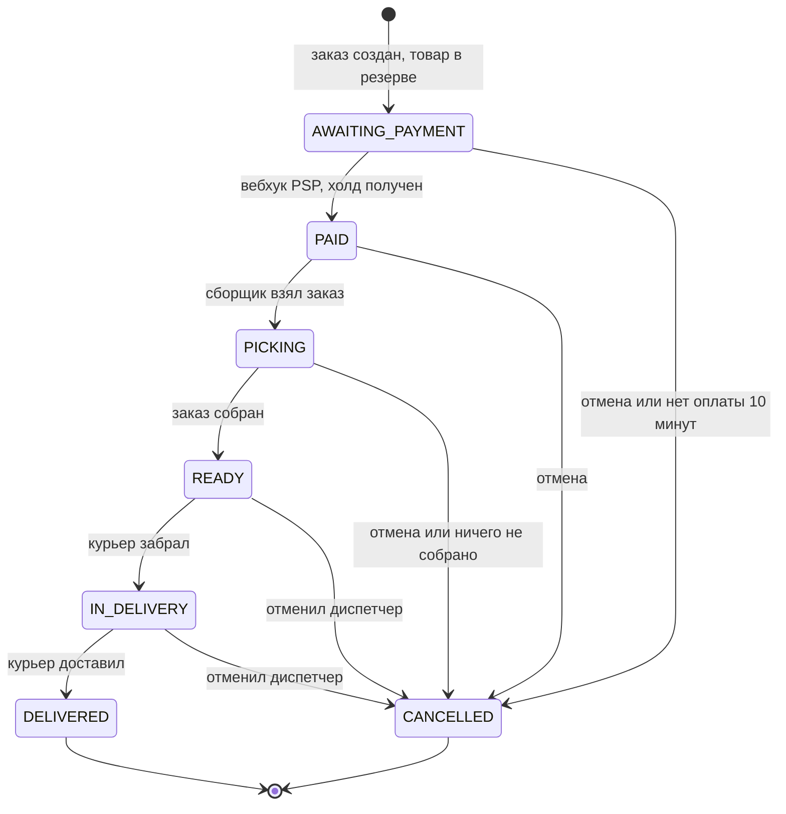
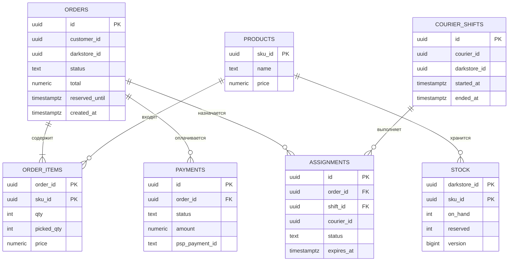

# LLD: eat-easy

Версия: v1, 30.09.2026. Контейнеры — в [HLD](hld.md), взаимодействия — в [MLD](mld.md).

## 1. State machine заказа



| Из | Событие | Кто | В | Что ещё происходит |
|---|---|---|---|---|
| — | `POST /orders` | покупатель | `AWAITING_PAYMENT` | резерв товара, платёж `PENDING` |
| `AWAITING_PAYMENT` | вебхук о холде | PSP | `PAID` | платёж `AUTHORIZED`, событие `OrderPaid` |
| `AWAITING_PAYMENT` | прошло 10 минут | фоновая задача | `CANCELLED` | резерв снят |
| `PAID` | взял в сборку | сборщик | `PICKING` | событие `OrderPicking` |
| `PICKING` | собрал | сборщик | `READY` | списание суммы собранного, платёж `CAPTURED` |
| `PICKING` | ничего не собрано | сборщик | `CANCELLED` | резерв снят, холд отменён |
| `READY` | забрал | назначенный курьер | `IN_DELIVERY` | событие `OrderInDelivery` |
| `IN_DELIVERY` | доставил | назначенный курьер | `DELIVERED` | назначение закрыто |
| `AWAITING_PAYMENT`, `PAID`, `PICKING` | отмена | покупатель или диспетчер | `CANCELLED` | резерв снят, холд отменён; отмена диспетчером записывается в аудит |
| `READY`, `IN_DELIVERY` | отмена | только диспетчер | `CANCELLED` | возврат денег, товар возвращается на полку, запись в аудит |

Всё, чего нет в таблице, запрещено и возвращает `409`. Например, нельзя взять на сборку неоплаченный заказ, а покупатель не может отменить заказ, который уже собран.

Переход делается одним запросом. Проверка старого статуса и запись нового — одна операция:

```sql
UPDATE orders SET status = :to, updated_at = now()
 WHERE id = :id AND status = :from;
-- обновлено 0 строк — статус уже другой, отвечаем 409
```

Так решаются гонки:

- покупатель отменяет заказ, а сборщик в этот момент завершает сборку — выполнится переход того, кто успел первым, второй получит `409`;
- вебхук о холде пришёл, когда заказ уже отменён по времени, — переход в `PAID` не выполнится, а холд будет отменён по событию `OrderCancelled`.

Статусы платежа: `PENDING` → `AUTHORIZED` → `CAPTURED`, плюс `CANCELLED` (холд снят), `REFUNDED` (деньги возвращены) и `FAILED` (банк отказал). Если банк отказал, заказ остаётся в `AWAITING_PAYMENT`, и покупатель может оплатить ещё раз: `POST /orders/{id}/payments` создаёт новый платёж, пока не истекли 10 минут.

## 2. Идемпотентность

Повторы приходят с четырёх сторон, для каждой свой ключ:

| Откуда повтор | Ключ | Где храним | Что получает повтор |
|---|---|---|---|
| Приложение повторяет `POST /orders` | `Idempotency-Key` + покупатель | таблица `idempotency_keys` | тот же заказ, `201` |
| Order Core повторяет вызов PSP | `paymentId` | на стороне PSP | тот же платёж, второго холда нет |
| PSP повторяет вебхук | `event_id` | таблица `psp_events` | `200`, ничего не меняется |
| RabbitMQ доставляет сообщение дважды | `message_id` | таблица `processed_messages` | сообщение пропускается |

Как работает ключ для `POST /orders`. Первая операция в транзакции создания заказа:

```sql
INSERT INTO idempotency_keys (customer_id, key, request_hash, order_id)
VALUES (:customer_id, :key, :request_hash, :order_id)
ON CONFLICT (customer_id, key) DO NOTHING;
```

- вставилась строка — запрос новый, создаём заказ дальше;
- не вставилась, `request_hash` совпал — это повтор, возвращаем уже созданный заказ;
- не вставилась, `request_hash` другой — `422 IDEMPOTENCY_KEY_REUSED`.

Если два одинаковых запроса пришли одновременно, второй ждёт на первичном ключе, пока первый не закончит транзакцию, и потом получает тот же заказ. Если первый откатился (например, товара не хватило), запись о ключе тоже откатывается, и второй выполняется как новый.

Ключи хранятся сутки, потом удаляются.

## 3. Данные



Служебные таблицы:

| Таблица | Ключ | Зачем |
|---|---|---|
| `idempotency_keys` | `(customer_id, key)` | повтор `POST /orders` |
| `psp_events` | `(event_id)` | повтор вебхука |
| `processed_messages` | `(consumer, message_id)` | повтор сообщения из очереди |
| `outbox` | `(id)` | исходящие события |
| `audit_log` | `(id)` | действия диспетчера: кто, когда, что сделал. Приложению разрешены только `INSERT` и `SELECT` |

### Ограничения

Главные правила из NFR-03 записаны в самой схеме. Если в коде будет ошибка, база не позволит нарушить правило.

```sql
-- резерв не может быть больше остатка
ALTER TABLE stock ADD CONSTRAINT stock_no_oversell
  CHECK (reserved >= 0 AND reserved <= on_hand);

-- у заказа не больше одного действующего оффера или назначения
CREATE UNIQUE INDEX ux_assignments_order_active
  ON assignments (order_id) WHERE status IN ('OFFERED', 'ACCEPTED');

-- у курьера не больше одного действующего оффера или назначения
CREATE UNIQUE INDEX ux_assignments_courier_active
  ON assignments (courier_id) WHERE status IN ('OFFERED', 'ACCEPTED');

-- у заказа не больше одного действующего платежа
CREATE UNIQUE INDEX ux_payments_order_active
  ON payments (order_id) WHERE status IN ('PENDING', 'AUTHORIZED', 'CAPTURED');
```

### Резерв товара

```sql
UPDATE stock
   SET reserved = reserved + :qty, version = version + 1
 WHERE darkstore_id = :darkstore_id AND sku_id = :sku_id
   AND on_hand - reserved >= :qty;
-- обновлено 0 строк — товара не хватает: откат всей транзакции, 409 OUT_OF_STOCK
```

Запрос выполняется по каждой позиции заказа. Позиции отсортированы по `sku_id`, чтобы два заказа с одинаковыми товарами не заблокировали друг друга.

Уровень изоляции — READ COMMITTED, как по умолчанию в PostgreSQL. Это важно: запрос, который ждал блокировку строки, после её снятия проверяет условие `WHERE` заново, уже на новых данных. Почему выбран условный `UPDATE`, а не `SELECT FOR UPDATE` или счётчик в Redis — в [ADR-002](adr-002.md).

Остальные операции с остатком:

| Операция | Что меняется |
|---|---|
| Отмена до сборки или истечение резерва | `reserved -= qty` |
| Сборка | `reserved -= qty`, `on_hand -= picked_qty` |
| Товара не оказалось на полке (`picked_qty < qty`) | дополнительно `on_hand = reserved`: свободного остатка больше нет, в каталоге товар пропадает |
| Отмена после сборки, товар вернули на полку | `on_hand += picked_qty` |
| Поставка из ТУС | `on_hand += delta` |

После каждой операции в outbox пишется событие `StockChanged` с новым доступным остатком и `version`. Catalog Service обновляет кэш, только если `version` больше той, что у него уже есть: старое событие не перезапишет новый остаток.

### Индексы

| Таблица | Индекс | Для какого запроса |
|---|---|---|
| `stock` | первичный ключ `(darkstore_id, sku_id)` | резерв |
| `orders` | `(customer_id, created_at DESC)` | история заказов |
| `orders` | `(darkstore_id, created_at) WHERE status IN ('PAID', 'PICKING', 'READY')` | очередь сборки, пульт диспетчера |
| `orders` | `(reserved_until) WHERE status = 'AWAITING_PAYMENT'` | поиск неоплаченных заказов |
| `assignments` | `(expires_at) WHERE status = 'OFFERED'` | поиск истёкших офферов |
| `courier_shifts` | `(darkstore_id) WHERE ended_at IS NULL` | курьеры на смене в дарксторе |
| `payments` | уникальный `(psp_payment_id)` | поиск платежа по вебхуку |
| `outbox` | `(created_at) WHERE published_at IS NULL` | неотправленные события |

Индексы заведены только под запросы, которые действительно выполняются: каждый лишний индекс замедляет запись заказа.

Ограничения по объёму: не больше 50 позиций в заказе, списки отдаются страницами по 20.

## 4. Контракт POST /orders

```http
POST /orders
Authorization: Bearer <token>
Idempotency-Key: 0f8fad5b-d9cb-469f-a165-70867728950e

{
  "addressId": "7c9e6679-7425-40de-944b-e07fc1f90ae7",
  "items": [
    { "skuId": "3fa85f64-5717-4562-b3fc-2c963f66afa6", "qty": 2 },
    { "skuId": "9b2d7c1e-8a44-4e0b-9d61-5f2c7a1b3e90", "qty": 1 }
  ],
  "expectedTotal": "446.90"
}
```

Ответ `201`:

```json
{
  "orderId": "018f3b6e-7c1a-7f2e-9a4b-2d6c5e8f1a30",
  "status": "AWAITING_PAYMENT",
  "total": "446.90",
  "reservedUntil": "2026-09-30T18:42:00Z",
  "payment": { "status": "PENDING", "confirmationUrl": "https://psp.example/confirm/abc" }
}
```

Если PSP не ответил, `confirmationUrl` в ответе нет — приложение ждёт push или опрашивает `GET /orders/{id}`.

| Код | Когда | Что делает приложение |
|---|---|---|
| `201` | Заказ создан или найден по ключу | Переходит к оплате |
| `400` | Пустая корзина, нет Idempotency-Key | Исправляет запрос |
| `401` | Нет токена или он просрочен | Обновляет токен |
| `409 OUT_OF_STOCK` | Товара не хватает, в ответе список позиций | Предлагает изменить корзину |
| `409 PRICE_CHANGED` | Сумма не совпала с `expectedTotal` | Показывает новую сумму |
| `422 ADDRESS_OUT_OF_ZONE` | Адрес не обслуживается | Показывает причину |
| `422 IDEMPOTENCY_KEY_REUSED` | Ключ уже был с другой корзиной | Генерирует новый ключ |
| `429` | Больше 5 заказов в минуту от одного покупателя | Ждёт и повторяет позже |
| `503` | База переключается или сервис перегружен | Повторяет с тем же ключом |

`409` и `422` — отказ по бизнес-правилам, повторять запрос без изменений бесполезно. `503` — сбой, запрос можно и нужно повторить.

## Источники

- Лекция 04.
- Kleppmann M. Designing Data-Intensive Applications — транзакции и идемпотентность.
- Документация PostgreSQL: частичные индексы, `INSERT ... ON CONFLICT`, уровни изоляции.

## Изменения

- v1, 30.09.2026 — первая версия
