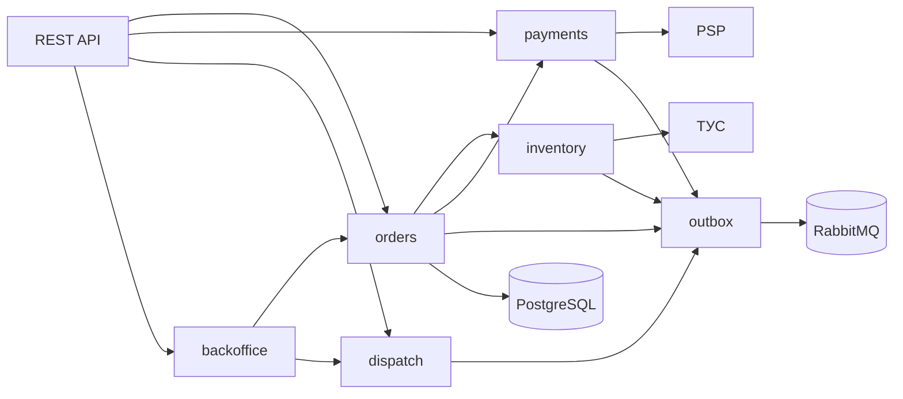
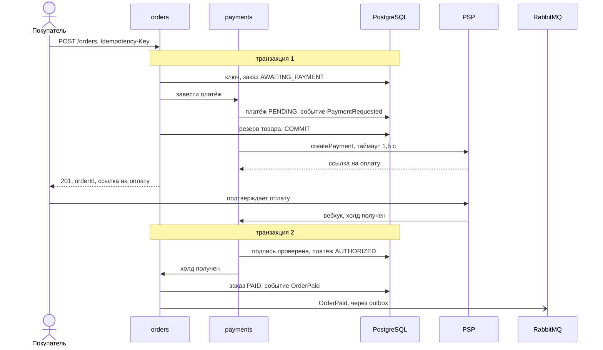
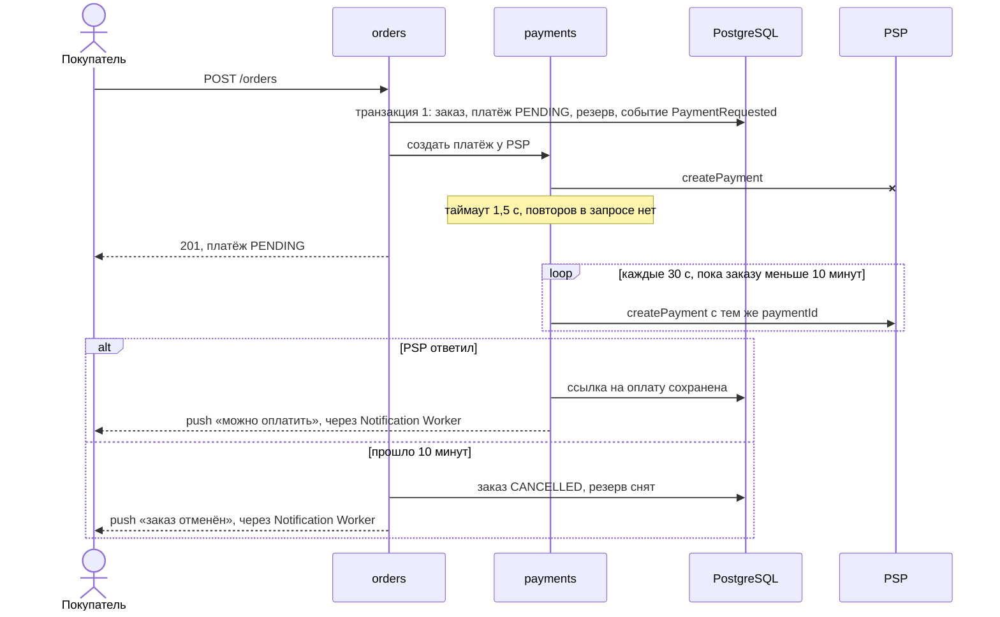

# MLD: eat-easy

Версия: v1, 30.09.2026. Контейнеры — в [HLD](hld.md), таблицы и состояния — в [LLD](lld.md).

## 1. Component: Order Core

Order Core — самый важный сервис: через него идут оба сценария про согласованность и сценарий с отказом PSP. Это одно приложение, внутри разбитое на модули ([ADR-001](adr-001.md)).

| Модуль | Что делает | Свои таблицы |
|---|---|---|
| orders | Создаёт заказ, ведёт его по статусам, отменяет неоплаченные | `orders`, `order_items`, `idempotency_keys` |
| inventory | Товары и цены из ТУС, остатки и резерв | `products`, `stock` |
| payments | Платежи, вебхуки PSP и проверка их подписи, повторы | `payments`, `psp_events` |
| dispatch | Смены курьеров, офферы и назначения | `courier_shifts`, `assignments` |
| backoffice | Пульт диспетчера, журнал аудита | `audit_log` |
| outbox | Общие таблицы событий и поток, который отправляет события в RabbitMQ | `outbox`, `processed_messages` |

Правила между модулями:

- модуль пишет только в свои таблицы, к чужим данным обращается через интерфейс модуля-владельца;
- `orders` вызывает `inventory` и `payments` через их интерфейсы. `payments` и `dispatch` модуль `orders` не вызывают: о своих результатах («холд получен», «курьер назначен») они сообщают событиями;
- внешнюю систему нельзя вызывать внутри транзакции БД. Иначе медленный PSP удерживал бы соединение с базой.

С базой работают все модули; на схеме стрелка одна, чтобы не повторять её пять раз.

Фоновые задачи Order Core:

- `orders` отменяет заказы, не оплаченные за 10 минут;
- `dispatch` передаёт оффер следующему курьеру, если его не приняли за 30 секунд, и отправляет заказ на пульт диспетчера, если курьер не найден за 3 минуты;
- `inventory` раз в минуту загружает товары, цены и поставки из ТУС.

## 2. Sequence: оформление и оплата, основной поток

Запросы и вебхуки проходят через API Gateway, на схеме он опущен. Резерв — последний шаг транзакции 1, чтобы строки остатка были заблокированы как можно меньше. `OrderPaid` читают `dispatch` (ищет курьера) и Notification Worker (отправляет push).

Сколько времени занимает `POST /orders` (p95):

| Шаг | мс |
|---|---|
| Gateway: токен, маршрут | 20 |
| Проверка запроса | 15 |
| Транзакция 1 | 60 |
| Вызов PSP | 500 |
| Ответ | 15 |
| **Всего** | **610** |

До порога в 1 секунду (NFR-02) остаётся запас 390 мс. Худший случай — PSP не отвечает до истечения таймаута: 20 + 15 + 60 + 1 500 + 15 = 1 610 мс, это меньше p99 ≤ 2 с.

## 3. Sequence: PSP не отвечает

Что здесь важно:

- заказ и резерв уже сохранены до вызова PSP, поэтому отказ провайдера ничего не откатывает;
- повтора внутри запроса нет: он удвоил бы время ответа и добавил бы нагрузку на PSP, который и так перегружен;
- повтор в фоне безопасен, потому что идёт с тем же `paymentId` — второй платёж PSP не создаст;
- событие `PaymentRequested` находится в outbox с момента транзакции 1. Даже если инстанс остановится сразу после неё, платёж всё равно будет создан;
- на сборку без оплаты заказ не уйдёт: в `PAID` он переходит только по вебхуку.

## 4. Resilience-политики

| Вызов | Таймаут | Повторы | Circuit breaker | Что делаем при отказе |
|---|---|---|---|---|
| Order Core → PSP, создание платежа | 1,5 с | В запросе 0. В фоне (обработчик `PaymentRequested`) каждые 30 с, пока заказу меньше 10 минут | Открывается, если из последних 20 вызовов половина завершилась ошибкой. Открыт 30 с | `201` с платежом `PENDING`, платёж создаётся в фоне |
| Order Core → PostgreSQL | 1 с на запрос | 1 повтор при deadlock | нет | `503`, приложение повторит с тем же ключом |
| Order Core → ТУС, фоновая загрузка раз в минуту | 5 с | Следующая попытка через минуту | нет | Работаем на последних загруженных данных |
| Catalog Service → Redis | 50 мс | 0 | Открывается при 50% ошибок, открыт 10 с | Читаем из read replica |
| Catalog Service → read replica | 500 мс | 0 | нет | Читаем с синхронной реплики в зоне B |
| Outbox → RabbitMQ | 2 с | Пока не получится | нет | События копятся в outbox |
| Остальные обработчики событий | 30 с на сообщение | 3 раза: через 5, 30 и 120 с | нет | Сообщение уходит в DLQ, срабатывает алерт |
| Notification Worker → push и SMS | 3 с | 3 раза | Открывается при 50% ошибок, открыт 60 с | Push не ушёл — отправляем SMS |

У обработчика `PaymentRequested` своя политика повторов (первая строка), потому что платёж нужно пытаться создать всё время, пока жив резерв. Для всех остальных обработчиков действует общая: три попытки и DLQ.

Ещё одно ограничение: одновременно к PSP идёт не больше 50 вызовов с одного инстанса (bulkhead). Если PSP перестанет отвечать, остальные потоки останутся для отмен, сборки и курьеров.

Почему такие числа:

- 1,5 с на PSP. Обычно он отвечает за 500 мс. С таймаутом 1,5 с худший случай — 1 610 мс, в p99 ≤ 2 с укладываемся. Если поставить меньше, будут обрываться нормальные, но медленные ответы.
- 0 повторов в запросе. Один повтор — это уже больше 3 секунд.
- 50 вызовов. При 10 заказах в секунду и ответе до 1,5 с одновременно идёт до 15 вызовов. 50 — с запасом.

Защита на входе: Gateway пропускает не больше 5 `POST /orders` в минуту от одного покупателя, сверх этого отвечает `429`. Приложение повторяет запрос максимум 3 раза и всегда с тем же Idempotency-Key.

Вебхук PSP: модуль `payments` сначала проверяет подпись. Если подпись неверная, отвечает `401` и ничего не меняет.

## 5. События

| Событие | Кто публикует | Кто читает | Зачем |
|---|---|---|---|
| `PaymentRequested` | payments | payments | Создать платёж у PSP, если он ещё не создан |
| `PaymentReady` | payments | Notification Worker | Сообщить покупателю, что платёж создан и можно оплатить |
| `OrderPaid` | orders | dispatch, Notification Worker | Искать курьера, уведомить покупателя |
| `OfferCreated` | dispatch | Notification Worker | Отправить курьеру оффер |
| `OrderPicking` | orders | Notification Worker | Уведомить покупателя, что заказ собирают |
| `OrderReady` | orders | payments, Notification Worker | Списать сумму собранного, уведомить курьера |
| `OrderInDelivery` | orders | Notification Worker | Уведомить покупателя, что курьер выехал |
| `OrderDelivered` | orders | Notification Worker | Уведомить покупателя |
| `OrderCancelled` | orders | payments, dispatch, Notification Worker | Отменить холд или вернуть деньги, отозвать оффер, уведомить |
| `StockChanged` | inventory | Catalog Service | Обновить остаток в кэше |

Очередь может доставить сообщение дважды, поэтому каждый читатель защищён от повтора:

- модули Order Core записывают номер сообщения в таблицу `processed_messages`;
- Notification Worker хранит номера обработанных сообщений в Redis сутки;
- Catalog Service применяет `StockChanged`, только если версия в событии больше той, что уже в кэше.

## Источники

- Лекция 04.
- Nygard M. Release It!, 2nd ed. — таймауты, circuit breaker, bulkhead.
- Richardson C. Microservices Patterns — transactional outbox.

## Изменения

- v1, 30.09.2026 — первая версия
