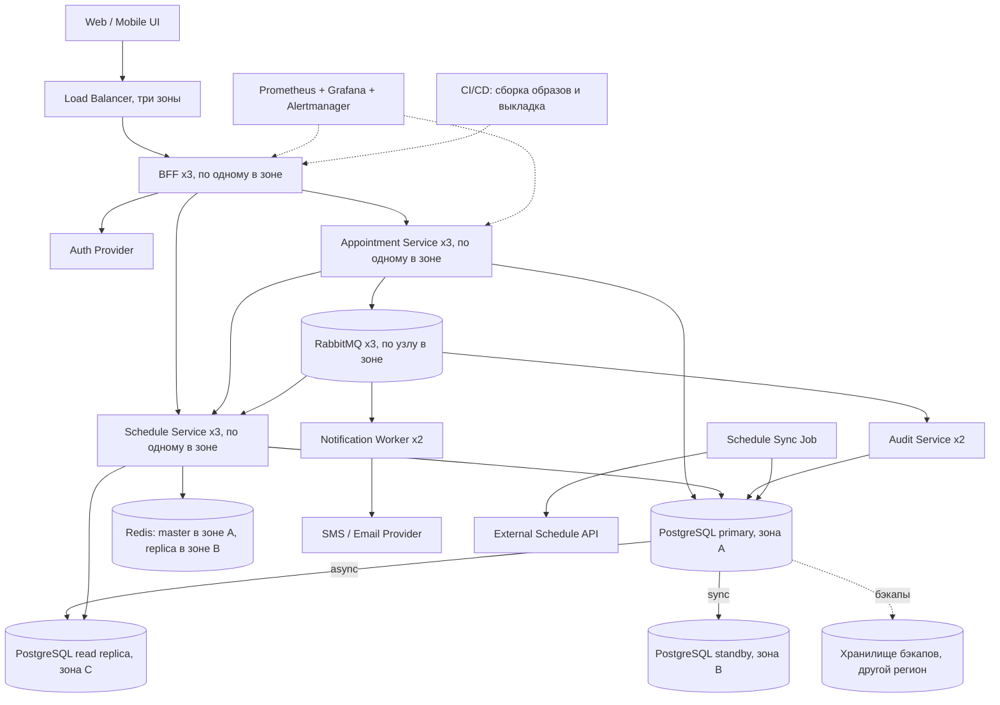

# MediBook: Deployment, Observability, Operability

Версия: v1, 01.10.2026

Чисел по нагрузке в лекции 09 нет, поэтому взял такие: пик поиска слотов — 1000 RPS (из нагрузочного теста в лекции 07), около 3 000 записей в сутки на одну клинику, на каждую запись два уведомления — пациенту и врачу.

Сценарии по важности — как на слайде про High Availability: запись на приём должна работать всегда, поиск слотов может деградировать, уведомления могут задержаться, аналитика может отставать.

## 1. Deployment view



Всё своё работает в Kubernetes в одном регионе облака, в трёх зонах доступности. Auth Provider, External Schedule API и SMS / Email Provider — внешние системы. Мониторинг собирает метрики со всех сервисов, CI/CD выкладывает все сервисы; на схеме показано по одной-две стрелки, чтобы её не перегружать. Секреты (пароли к базе, ключи провайдеров) хранятся в Kubernetes Secrets.

| Компонент | Сколько | Как масштабируется | Если один инстанс отказал |
|---|---|---|---|
| Load Balancer | управляемый, в трёх зонах | провайдером | трафик идёт через остальные зоны |
| BFF | 3 | горизонтально, состояния нет | два оставшихся выдерживают нагрузку |
| Appointment Service | 3 | осторожно: вся запись идёт через primary, новые инстансы только добавят соединений к базе | клиент повторяет запрос с тем же `idempotencyKey` |
| Schedule Service | 3, до 6 под нагрузкой | горизонтально, читает из Redis и read replica | кэш общий, ничего не теряется |
| Schedule Sync Job | запуск раз в 5 минут | один запуск за раз | следующий запуск стартует на другом узле |
| Notification Worker | 2, до 6 по длине очереди | отдельно от основного потока | сообщения остаются в очереди |
| Audit Service | 2 | вручную | работает второй |
| PostgreSQL | primary, sync standby, read replica — в разных зонах | запись вертикально, чтение через реплику | standby становится primary за 30–60 секунд, данные не теряются |
| Redis | master + replica | вертикально | 10–30 секунд поиск читает из базы |
| RabbitMQ | 3 узла | — | два узла из трёх продолжают работать |

**Сколько инстансов нужно.** Правило одно: потеря одной зоны не должна останавливать запись и поиск. Поэтому BFF, Appointment Service и Schedule Service развёрнуты по три, по одному на зону. Уведомлениям и аудиту достаточно двух.

**Где критические зависимости.** Запись на приём идёт по цепочке Load Balancer → BFF → Appointment Service → PostgreSQL primary, плюс Auth Provider для входа. Всё остальное с этого пути убрано: событие для уведомлений пишется в таблицу outbox в той же транзакции, и очередь в записи не участвует. Schedule Service нужен только для предварительной проверки слота. Если он не ответил за 300 мс, проверка пропускается: существование слота проверит внешний ключ, а занятость — уникальный индекс в базе ([ADR-001 из ДЗ 8](../hw8/adr-001.md)).

**Как масштабируется чтение слотов.** Поиск читает из Redis, при промахе — из read replica. При попадании в кэш 90% из 1000 RPS до базы доходит около 100. Кэш сбрасывается событиями о записи и отмене, плюс у ключей время жизни 30 секунд на случай потерянного события. Schedule Service растёт от 3 до 6 инстансов по нагрузке.

**Как обновлять без остановки записи.** Rolling update: новый инстанс сначала поднимается и проходит проверку готовности, только потом останавливается старый, и старому даётся 30 секунд на завершение запросов. Для Appointment Service — canary: сначала один инстанс новой версии; если на нём растёт доля 5xx, выполняется автоматический откат. Изменения схемы базы делаются так, чтобы старая версия кода работала на новой схеме.

## 2. SPOF

«Допустим?»: **нет** — убираем сразу; **временно** — допустим на пилоте в одной клинике, потом убираем; **да** — остаётся, принимаем.

| № | SPOF | На что влияет | Допустим? | Что делаем |
|---|---|---|---|---|
| 1 | PostgreSQL без реплики | Запись, поиск, аудит. Плюс потеря данных | нет | Sync standby в другой зоне, автоматическое переключение, бэкапы |
| 2 | Единственный брокер | Уведомления и события аудита. На запись не влияет | временно | 3 узла. События хранятся в outbox, пока брокер недоступен |
| 3 | Синхронизация расписания без резерва | Расписание устаревает | нет | Запуск по расписанию в Kubernetes: если запуск не удался, следующий стартует на другом узле |
| 4 | Load Balancer в одном экземпляре | Всё | нет | Управляемый балансировщик в трёх зонах |
| 5 | Одна зона доступности | Всё | нет | Три зоны, инстансы и узлы баз распределены по ним |
| 6 | Redis в одном экземпляре | Поиск становится медленнее | временно | Replica. Без Redis читаем из read replica |
| 7 | Read replica в одном экземпляре | Поиск при промахе кэша | временно | При её отказе Schedule Service читает со standby |
| 8 | Notification Worker в одном экземпляре | Уведомления задерживаются | временно | Два инстанса. Сообщения в очереди не теряются |
| 9 | Мониторинг в одном экземпляре | Авария пройдёт без алерта | временно | Два Prometheus в разных зонах |
| 10 | Auth Provider | Вход. Кто уже вошёл, работает, пока действует токен (15 минут) | да | Система внешняя, второго провайдера нет. BFF проверяет токен сам, без обращения к Auth Provider. Алерт A4 |
| 11 | External Schedule API | Расписание перестаёт обновляться | да | Второго источника расписания нет. Работаем по своей копии и показываем время последнего обновления |
| 12 | SMS / Email Provider | Уведомления | да | Задержка допустима. Retry, DLQ, при сбое SMS отправляем email |
| 13 | Один регион | Всё | да | Клиника в одном городе, второй регион — вдвое дороже. Бэкапы хранятся в другом регионе |
| 14 | Управляющая часть Kubernetes | Автоматика: перезапуск подов, масштабирование, запуск синхронизации. Работающие сервисы продолжают отвечать | да | Управляемый сервис провайдера в трёх зонах |
| 15 | Восстановление умеет выполнять один человек | Время восстановления: ночью или в отпуск простой растягивается на часы | нет | Автоматическое переключение базы, runbook на каждый алерт, инфраструктура описана в Git |

## 3. Восемь ключевых метрик

| № | Метрика | Что показывает | Норма | Порог | Что делаем |
|---|---|---|---|---|---|
| 1 | Latency | p95 и p99 времени ответа на поиске слотов и на записи | поиск: p95 до 0,5 с | p95 поиска больше 2 с — алерт A1 | Смотрим метрики 5 и 6: причина в кэше или в базе |
| 2 | Throughput | Запросов в секунду по каждому сервису | 5–30 RPS днём, до 1000 в пик | больше 800 RPS дольше 10 минут | Добавляем инстансы Schedule Service |
| 3 | Error Rate | Доля ответов 5xx на создании записи. 409 «слот занят» ошибкой не считается | меньше 0,05% | 0,1% — граница SLO-2, разбираем днём; 1% — алерт A2 | После релиза — откат. Иначе проверяем базу |
| 4 | Queue Lag | Сколько сообщение ждёт в очереди уведомлений | до 10 с | больше 60 с — добавляем воркеров; больше 5 минут — алерт A3 | Добавляем воркеров, дальше по runbook |
| 5 | Cache Hit Ratio | Доля поисков, обслуженных из Redis | 90% и выше | ниже 70% в течение 10 минут | Проверяем Redis и время жизни ключей |
| 6 | DB Pool Usage | Доля занятых соединений с базой у Appointment Service | ниже 50% | выше 80% | Ищем долгие транзакции. Инстансы не добавляем: число соединений базы ограничено |
| 7 | Конфликты записи | Доля ответов 409 на создании записи | ниже 3% | выше 10% | Поиск показывает занятые слоты — проверяем сброс кэша |
| 8 | Неотправленные уведомления | Число сообщений в DLQ | 0 | больше 0 — разбираем днём; растёт 10 минут — алерт A3 | Ищем причину в логах воркера, переотправляем |

Метрики 1 и 3 снимаются на BFF: если Appointment Service недоступен, свои метрики он уже не отдаст.

## 4. Пять алертов с привязкой к SLO

Четыре SLO из лекции и один мой:

| № | SLO |
|---|---|
| SLO-1 | Поиск слотов: p95 < 2 с |
| SLO-2 | Запись на приём: 99,9% успешных операций |
| SLO-3 | Appointment Service: 99,5% uptime в месяц |
| SLO-4 | 99% уведомлений доставлены за 5 минут. В лекции указано только «< 5 мин»; долю 99% добавил сам, без неё цель не измерить |
| SLO-5 | 99,9% операций администратора попадают в журнал аудита не позже чем через 5 минут. Этого SLO на слайде нет, добавил сам: иначе алерт про аудит не к чему привязать |

Все SLO считаются за 30 дней.

| № | Алерт | SLO | Когда срабатывает | Кого оповещает | Первое действие |
|---|---|---|---|---|---|
| A1 | Рост p95 на поиске слотов | SLO-1 | p95 поиска больше 2 с в течение 10 минут | дежурного, в рабочее время клиники | Смотрим Cache Hit Ratio. Ниже 70% — причина в Redis, иначе в базе |
| A2 | Скачок 5xx в Appointment Service | SLO-2, SLO-3 | 5xx на создании записи больше 1% за 5 минут и не меньше 5 ошибок | дежурного, круглосуточно | Был релиз за последние полчаса — откат. Не было — проверяем PostgreSQL |
| A3 | Рост DLQ | SLO-4 | В DLQ появились сообщения и их число растёт 10 минут, либо сообщения ждут в очереди дольше 5 минут | дежурного, в рабочее время | Runbook RB-02 ниже |
| A4 | Недоступность Auth | SLO-3 | Больше 5% ошибок при обращении к Auth Provider за 5 минут, либо проверка доступности не проходит 2 минуты | дежурного, круглосуточно | Статус провайдера, сообщение «запись по телефону» в интерфейсе, обращение в поддержку провайдера |
| A5 | Нет Audit Events | SLO-5 | Запись об операции администратора не появилась в журнале аудита за 5 минут | дежурного, круглосуточно | Проверяем Audit Service и очередь |

Про привязку A4. Отдельного SLO на вход на слайде нет, поэтому A4 привязан к SLO-3: если вход не работает, записаться нельзя, и для пациента это тот же простой.

Почему такие пороги:

- A2. SLO-2 допускает 0,1% ошибок. 1% — в десять раз больше: если так продержится час, израсходуется около 1,4% месячного запаса ошибок. Условие «не меньше 5 ошибок» нужно, потому что запросов мало: днём это около 20 записей за 5 минут, и одна случайная ошибка уже даёт 5%. Мелкие сбои видны по метрике 3 и разбираются днём.
- A1. Десять минут ожидания нужны, чтобы не реагировать на короткий всплеск.
- A3 и A5. Порог в 5 минут совпадает с самими SLO-4 и SLO-5: алерт срабатывает в момент, когда цель уже нарушается.

Как снижен шум: все пять алертов срабатывают на то, что видит пользователь или аудитор. Загрузка CPU, перезапуски и отставание репликации остаются на дашбордах. A1 и A3 ночью дежурного не вызывают: клиника закрыта, поиск и уведомления ждут до утра.

## 5. Runbook RB-02. Уведомления не уходят

Связан с алертом A3. Запись на приём при этом работает.

**Симптомы**

- сработал A3: растёт DLQ или очередь уведомлений не разбирается;
- регистратура сообщает, что пациентам не приходят SMS.

**Возможные причины**

1. SMS-провайдер недоступен или отвечает ошибками: лимит, баланс, истёк ключ.
2. Notification Worker аварийно завершается после релиза и не читает очередь.
3. Воркеров не хватает на всплеск.
4. Неисправен сам брокер.

**Шаги диагностики**

```bash
# состояние очередей: сколько сообщений и есть ли читатели
kubectl -n medibook exec rabbitmq-0 -- rabbitmqctl list_queues name messages consumers

# работают ли воркеры
kubectl -n medibook get pods -l app=notification-worker

# что пишет воркер
kubectl -n medibook logs -l app=notification-worker --tail=100
```

Читателей 0 или поды не в `Running` — причина 2. Читатели есть, в логах ошибки провайдера — причина 1. Ошибок нет, очередь растёт — причина 3.

**Безопасные действия**

- Причина 1: очередь не трогаем, сообщения сохранятся. Проверяем статус провайдера, включаем отправку по email вместо SMS.
- Причина 2: откатываем Notification Worker на предыдущую версию.
- Причина 3: увеличиваем число воркеров до 6.
- Когда причина устранена — переотправляем сообщения из DLQ в основную очередь. Дублей не будет: воркер пропускает уведомления, которые уже отправил.

Нельзя: очищать очередь (уведомления будут потеряны), рассылать SMS скриптом в обход воркера, перезапускать сразу несколько узлов RabbitMQ.

**Критерии эскалации**

- за 15 минут причина не найдена — подключаем разработчика Notification Worker;
- причина 4 — сразу дежурного по платформе;
- провайдер недоступен больше 30 минут — сообщаем администратору клиники, регистратура обзванивает пациентов с приёмом на ближайшие сутки.

## Источники

- Лекция 09 «Deployment, Observability, Operability» — список SPOF, метрики, SLO и алерты.
- Лекции 07 и 10 — сценарии и требования MediBook.
- Site Reliability Engineering (Google), главы про SLO и мониторинг.
- Документация RabbitMQ и Kubernetes.

## Изменения

- v1, 01.10.2026 — первая версия
